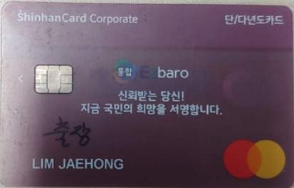

출장
====

국내 출장
--------

1. 가장 먼저, **구글달력에 출장 날짜를 표시합니다.**

2. 국내 출장 **POVIS** 신청할 때

   A. 첨부파일

      -  **출장 목적을 보이는 자료**

      - | **참석을 확인할 수 있는 자료** 
        | (초청장, 출장자 이름이 나와있는 프로그램, 학회등록비영수증 등)

   B. 결재선 지정은 팀장만 넣습니다.

3. 사후정산 때도 결재선 지정은 팀장만 넣습니다.

4. 출장시 교통비, 숙박비, 학회등록비 등등 비용은 아래의 카드를 사용해야
   합니다.

5. | **숙박비 정산** 은 위의 카드를 사용해서 *출장 가기 전에 미리
     정산* 하기 바랍니다.
   | 출장자가 카드를 갖고 출장가면, 나머지 팀원들이 카드 사용을 못 하는
     불편이 있습니다.
   | 숙박비 정산은 POVIS에서 출장의 사후정산으로 합니다.

6. | **학회등록비** 도 위의 카드를 사용해서 *출장 가기 전에 사전
     등록* 하기 바랍니다.
   | 출장자가 카드를 갖고 출장가면, 나머지 팀원들이 카드 사용을 못 하는
     불편이 있습니다.
   | 학회등록비 정산은 출장비가 아니라 *기술정보활동비* 로 정산합니다.
   | 카드 결제 후, 카드영수증을 김량림 선생님께 제출하면, 김량림
     선생님께서 기안을 하십니다.
   | *학회등록비에 연회비가 포함되어 있는 경우 김량림 선생님께 미리
     의논하시기 바랍니다.*

국외 출장
--------

1. 가장 먼저, **구글달력에 출장 날짜를 표시합니다.**

2. **해외출장계획서** 와 필요시 **논문발표신청서** 를 품의하고, 승인을 받습니다.

3. **POVIS** 신청할 때

   A. 첨부파일

      -  **출장 목적을 보이는 자료**

      - | **참석을 확인할 수 있는 자료** 
        | (초청장, 출장자 이름이 나와있는 프로그램, 학회등록비영수증 등)

      -  승인 난 **해외출장계획서** 와 **논문발표신청서**

   B. 결재선 지정은 **해외출장계획서** 의 결재선과 동일합니다.

4. 사후정산 때 결재선 지정은 팀장만 넣습니다??? ``확인 요망``

5. 출장시 교통비, 숙박비, 학회등록비 등등 비용은 아래의 카드를 사용해야
   합니다.

6. | **숙박비 정산** 은 위의 카드를 사용해서 *출장 가기 전에 미리
     정산* 하기 바랍니다.
   | 출장자가 카드를 갖고 출장가면, 나머지 팀원들이 카드 사용을 못 하는
     불편이 있습니다.
   | 숙박비 정산은 POVIS에서 출장의 사후정산으로 합니다.

7. | **학회등록비** 도 위의 카드를 사용해서 *출장 가기 전에 사전
     등록* 하기 바랍니다.
   | 출장자가 카드를 갖고 출장가면, 나머지 팀원들이 카드 사용을 못 하는
     불편이 있습니다.
   | 학회등록비 정산은 출장비가 아니라 *기술정보활동비* 로 정산합니다.
   | 카드 결제 후, 카드영수증을 김량림 선생님께 제출하면, 김량림
     선생님께서 기안을 하십니다.
